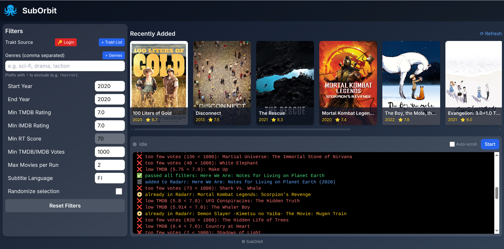
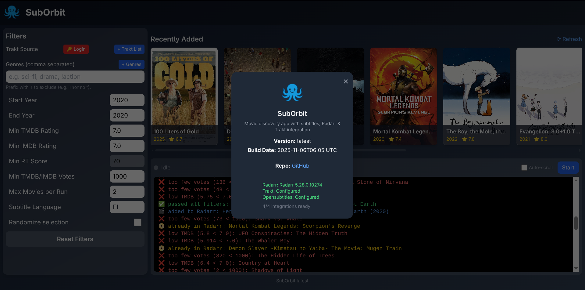

# 🪐 SubOrbit

**Smart subtitle-aware movie fetcher for Radarr users.**  
SubOrbit discovers movies with subtitles in your chosen language, filters them by ratings, and adds them directly to Radarr — all through a clean Flask + Tailwind web UI.



---

## ✨ Features


- 🔍 Filter by TMDB, IMDB, and Rotten Tomatoes ratings
- 🎲 Optional random selection for variety
- 🧩 Radarr integration (add filtered movies automatically)
- 🧠 Trakt list support (public or private)
- 📦 Docker-ready with zero dependencies
- 🌐 Responsive web UI (Flask + TailwindCSS)
- 🧾 Export results to CSV for curation or analytics

---

## 🚀 Quick Start

### 1. Run with Docker

```bash
docker run -d \
  --name=suborbit \
  -p 5000:5000 \
  -v /mnt/user/appdata/suborbit:/config \
  --env-file /mnt/user/appdata/suborbit/.env \
  ghcr.io/velinea/suborbit:latest
```
Open web UI http://localhost:5000

### 2. Configuration (.env)

Example:
```
# API KEYS
TMDB_API_KEY=           # https://api.themoviedb.org/3/discover/movie
OS_API_KEY=             # https://api.opensubtitles.com/api/v1/subtitles
OMDB_KEY=               # http://www.omdbapi.com/
TRAKT_CLIENT_ID=        # https://trakt.tv
TRAKT_CLIENT_SECRET=

RADARR_API=http://localhost:7878/api/v3
RADARR_HOST=            # Optional, the url client can use to connect to Radarr, if not on the same LAN (e.g. Tailscale name/ip)
RADARR_KEY=

# YEARS
START_YEAR=2020
END_YEAR=2020

# RATINGS
MIN_TMDB_RATING=7.0
MIN_IMDB_RATING=7.0
MIN_RT_SCORE=70

USE_TMDB=true
USE_IMDB=true
USE_RT=true             # Note: all movies don'thave RT rating

# RADARR
QUALITY_PROFILE_ID=4    # Wanted profile in Radarr, normally start from 1
ROOT_FOLDER=/movies     # Your media root in Radarr
SEARCH_FOR_MOVIE=false  # Start searching movie after adding to Radarr

# SCRIPT BEHAVIOR
QUIET_MODE=false        # Print messages to log file
DEBUG=true              # Print info/debug messages on Log window
MAX_MOVIES_PER_RUN=5
OS_DELAY=3              # Delay (s) between queries to Opensubtitles.com 
RANDOM_SELECTION=true

# EXTRA FILTERS
MIN_VOTE_COUNT=1000
ALLOWED_GENRES=
MAX_DISCOVER_PAGES=5    # TMDB discovery returns 20 items per page
SUBTITLE_LANG=FI        # 2-letter ISO 639-1 language code

```
---
### 🧠 Usage
---
#### Web UI

- Access the dashboard at http://localhost:5000.
- Adjust filters and start/stop runs 
- Follow progress live in the log window

---
### 🧩 Unraid Installation
---

- Find SubOrbit in the Unraid “Apps” tab and click Install.
- Configure /config volume and .env settings.

Access via http://[server_ip]:5000.

---
## 🛠️ Build locally

#### Build and run locally
```
docker build -t suborbit .
docker run -p 5000:5000 suborbit
```

To rebuild Tailwind CSS (if you edit templates):
```
make css
```
---
## 🧾Environment Overview


| Component                     | Purpose                           |
| ----------------------------- | --------------------------------- |
| Flask                         | Lightweight web server & API      |
| TailwindCSS                   | Responsive modern UI              |
| OpenSubtitles                 | Source for subtitle availability  |
| TMDB / OMDB / Rotten Tomatoes | Movie metadata and ratings        |
| Trakt                         | Optional source lists             |
| Radarr API                    | Add filtered movies automatically |

---
## 📦 Docker Tags
	

| Tag    | Description          |
| ------ | -------------------- |
| latest | Development release       |
| vX.Y.Z | Stable version     |

---
## 💡 Example Screenshot


---
## 🪪 License

MIT License

---
## 🌟 Acknowledgments

- OpenSubtitles.org
- TMDB
- OMDb API
- Trakt.tv
- Radarr
- Inspired by open-source media automation projects and the ARR community 💬

## SubOrbit — bringing your movie orbit closer to perfect subtitles.